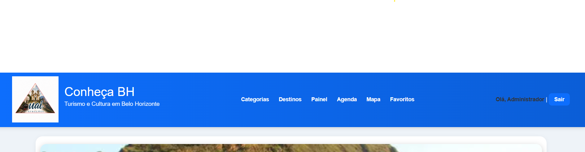
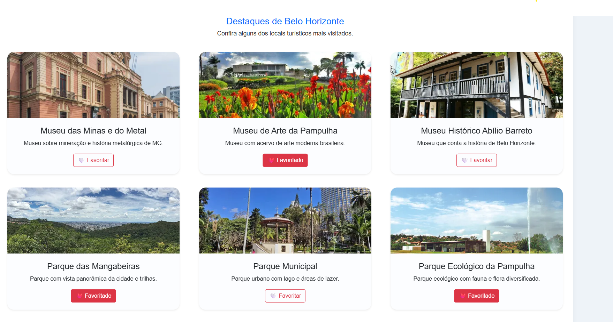
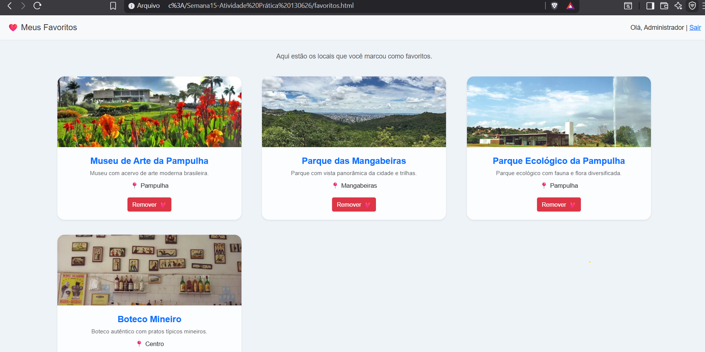

Semana 15 - Conheça BH
Informações do aluno

Nome: Patricia de Souza
Matrícula: 901262

Descrição do Projeto
O projeto “Conheça BH” é um sistema web para apresentação de pontos turísticos de Belo Horizonte, permitindo que o usuário explore locais, filtre categorias, cadastre novos destinos e interaja com os conteúdos de forma dinâmica.

Nesta atividade, foi implementado um sistema de login de usuários e uma funcionalidade de personalização com favoritos, permitindo que cada usuário marque locais de interesse e tenha sua própria lista salva.

Funcionalidades

O sistema possui autenticação de usuários utilizando sessionStorage.

Usuários de teste:
Login: admin | Senha: 123
Login: user | Senha: 123

Funcionamento do login:
O usuário realiza login na página /modulos/login/index.html
Ao autenticar, os dados são armazenados em sessionStorage
O sistema identifica automaticamente o usuário logado na Home

Funcionalidade de favoritos:

Login e logout com sessionStorage
Identificação automática do usuário na interface
Proteção de acesso à funcionalidade de favoritos
Sistema de favoritos por usuário
Persistência de dados no localStorage
Atualização dinâmica dos cards
Página “Meus Favoritos”
Renderização dinâmica de locais turísticos

Tecnologias utilizadas

HTML5
CSS3
JavaScript (Vanilla JS)
Bootstrap 5
LocalStorage
SessionStorage

Prints do projeto

Home com usuário logado

 Funcionalidade de favoritos

Página Meus Favoritos

